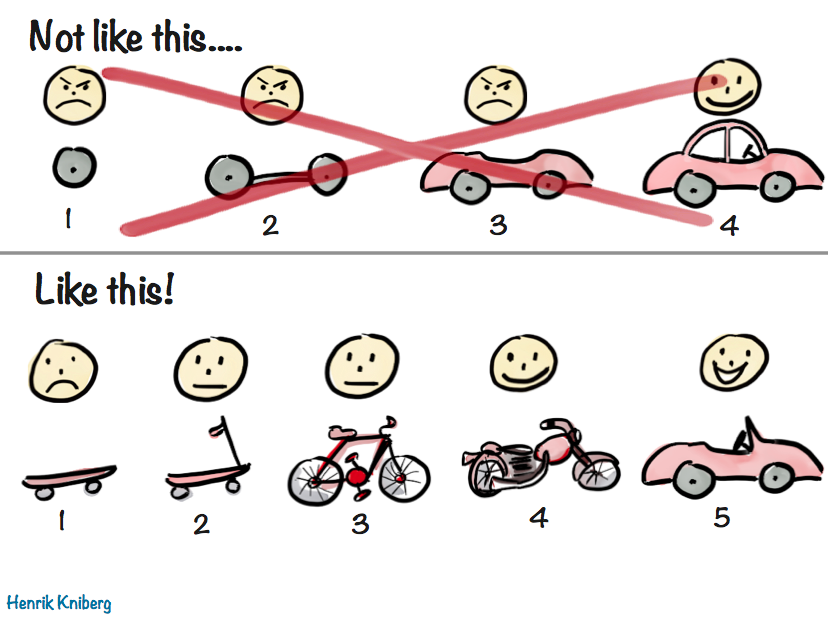

# gameproject (or project: GAME) 

## repo for project 1 of GA-SEIF 8.

Used:  
[PixiJS](https://pixijs.com/) for WebGL / canvas rendering.

[Advanced game design with HTML5 and javascript][B] by Rex van der Spuy for concepts in game design.

[Spriters Resource][A] and [itch.io][C] for game assets, and [ShoeBox] for extracting / packing sprites.

[Jest] in an attempt to unit test my code before realising i was doing it wrong

misc.

*these are things that i have generally come to use because they add a lot of value just having them around after they're set up:*

[Vite] because it provides great features and works right out of the box  
[ESLint] to yell at me when my JS doesn't make sense   
[StyleLint] to politely tell me when my CSS is ugly   
[TypeScript] to yell at me because V cannot be a `keyof typeof T extends Partial<U>`  
[Prettier] for formatting  
[PostCSS] because the 8 lines of CSS i wrote *REALLY* needed optimising. (actually, autoprefixer).  
[PnPM] so i can install all the above everywhere without killing my hard drive 

[B]: https://www.goodreads.com/book/show/25580285-advanced-game-design-with-html5-and-javascript 
[A]: https://www.spriters-resource.com/
[C]: https://itch.io/
[ESLint]: https://eslint.org/
[prettier]:https://prettier.io/
[StyleLint]: https://stylelint.io/
[TypeScript]: https://www.typescriptlang.org/
[shoebox]: https://renderhjs.net/shoebox/
[postcss]:https://postcss.org/
[vite]:https://vitejs.dev/
[Jest]: https://jestjs.io/
[pnpm]: https://pnpm.io/

## Objectives
----------

### My Objectives
- build a game with HTML5, CSS and Javascript.
- have fun doing it.

### ACTUAL Objectives
> 🔴 Mandatory To Pass:  
>  **MVP - Minimum Viable Product**  
>  Your game must meet these requirements:  
>    - Built with HTML, CSS and JavaScript (jQuery is strongly optional)
>    - Use Javascript for DOM manipulation
>    - Hosted on Github pages
>    - Commits to Github frequently
>    - A README.md file with explanations of the technologies used, the approach taken, a link to your live site, installation instructions, unsolved problems, etc.
>    - Be displayed in the browser  
>    - Have some kind of user interaction via mouseclick or keypress  

## Project plan

--- 

### At inception:
> "some kind of simple 2d game where the player can walk around a small number of areas, interacting with the environment by some combat and minigames."

#### Broad objectives:
- Animated sprites
- Interacting with NPCs (merchant / minigames)
- Combat
- Interacting with environment (picking up, breaking stuff)

### Functionality implemented:
#### **Display**
- Writing a DisplayObject class, which served as the base of all game sprites  including:
    - AnimatedSprite class with methods to loop through sequence of frames
    - Enemy class which defined base mob behaviour (idle, wandering) 
#### **Player Character**    
- Player control by keyboard and mouse input.
    - Player action defined by state of hero object at given time, e.g.
        - firing and arrow triggers a short delay; 
        - player attack animation not triggered if no enemies near
#### **Interaction**
- Interaction with environment by:
    - combat
    - proximity (i.e. collision, picking up stuff)
#### **Physics**
- Vector based collision detection
- Game entities react to collision (e.g. bounce, deflect)
- Grid based collision detection

### FUNCTIONALITY ABANDONED:
> #### **Display**
> - ❌~~Writing a DisplayObject class, which served as the base of all game sprites  including:~~
>     - ❌~~AnimatedSprite class with methods to loop through sequence of frames~~
>     - ❌~~Enemy class which defined base mob behaviour (idle, wandering)~~  
 
*the displayobject class started as an attempt to encapsulate one set of functionality in a class. though it worked for a while, new requirements meant new functionaliy was tack on to it, ending with a giant tangle of functions that became difficult to work with*
> #### **Player Character**    
> - Player control by keyboard and mouse input.
>    - Player action defined by state of hero object at given time, e.g.
>         - firing and arrow triggers a short delay; 
>         - player attack animation not triggered if no enemies near
> #### **Interaction**
> - Interaction with environment by:
>     - ❌~~combat~~
>     - proximity (i.e. collision, picking up stuff)

*ranged combat worked - melee combat was near impossible. looking back at the time of writing, i think it must have been because ranged combat used a test-point-in-shape based collision detection system; i could accurately place a point, placing a shape was unreliable at best; melee combat required detecting collision between **two** shapes - difficult at best, and basically impossible considering it used sprite hitboxes, which meant shapes calculated off another shape. they would sometimes be offset by as much as half the game screen width.*
> #### **Physics**
> - ❌~~Vector based collision detection~~
> - ❌~~Game entities react to collision (e.g. bounce, deflect)~~
> - Grid based collision detection

*vector based collision and physics with objects that have positions i had no clue about meant things were colliding and bouncing all over the place for no discernible reason. at best, i can probably say i **think** it worked.*

## **Final game presented for evaluation** 
You can walk around. There's a garden area with plants that grow, and you can pick them. 

**EXCITEMENT AWAITS!**

----------

# **Reflections**

*I saw this comic while i was reading for the project, about a week before the deadline. I felt personally attacked.*

Of the things i set out to accomplish with this project, a majority had been done before, in some form or another:
-  minigames: 
    - rock paper scissors lizard spock
    - card games
    - games of chance
- combat, inventory
    - basically each entity (player, enemy) is a collection of stats(properties). combat is just comparing the respective stats and calculating the outcome.
- interacting with NPCs
    - just a scripted interaction. WOULD YOU LIKE TO KNOW MORE? (YES/NO)

That being the case, i put getting the visual element up and running as the priority, and as i encountered unexpected issues, i worked solved or worked around them in ways that resulted in a situation that made it difficult to implement the gameplay functionalty ( sword attacks don't register on enemy, but enemy dies/disappears for no discernible reason when i'm walking through the debugger ).

In the end, i had to scrap most of what i had done previously and start almost from scratch, in order to meet the minimum deliverable for the project. I wrote TONS of code that ended up unused. 

I had initially put a tile based system out of consideration as i assumed it would add unnecessary complexity. I ended up using it for the project that was presented. 

This project did not go at all the way i expected, but i learned a lot, and had a bunch of fun at it. I have a better understanding of using tests, and i look forward to using it in future projects. I learned how to efficiently use arrays (by first using them inefficiently). I learned that school didn't teach us about circles and triangles just because shapes are neat. I know promises better now, by finding and trying interesting ways they can be used. 

# Next steps...?

I'm going to go through and cull the unused code, and make a branch to reflect the state in which it was submitted.

After that, I'll probably work in some of the things i had already started working on but couldnt complete. There's a whole bunch of assets i had prepared but had to abandon putting them in to be able to bring the game to a (barely) deliverable state. 
